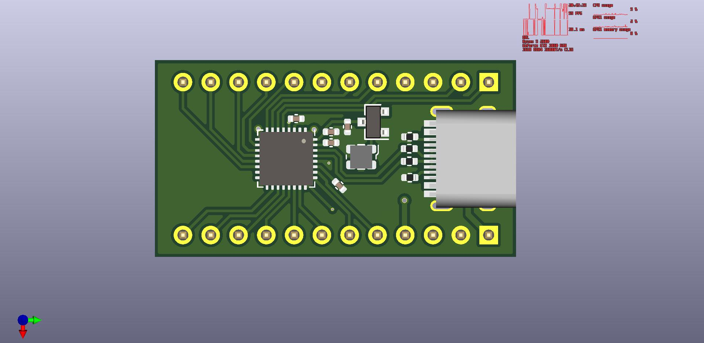

# AT90USB-ProMicro
 A AT90USB Pro Micro sized board.

I quickly threw this together on a whim because why not, it needs a bit of tweaking to perfectly fit a pro micro footprint but in theory this should work if you get all the parts and solder it on.

I am also thinking about making a Pro Micro to RPI Pico adapter of some sort since pro micro sized boards are both popular and widely avaliable.

This has been nicknamed the Envi-C where the C stands for Cat.
